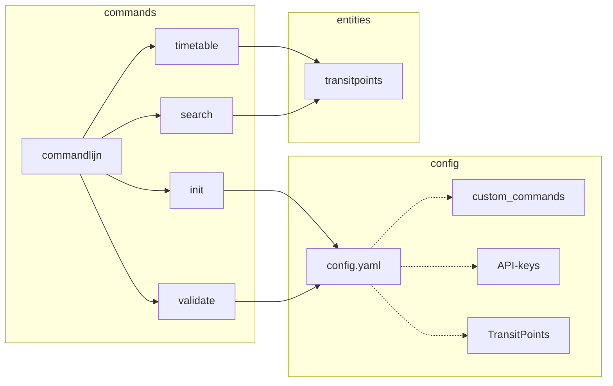

```mermaid
flowchart LR;
subgraph config
config.yaml
custom_commands
API-keys
TransitPoints
end

subgraph commands
    commandlijn;
    init;
    validate
    timetable
    search
end

subgraph entities
transitpoints
end

commandlijn --> init --> config.yaml;
commandlijn --> validate --> config.yaml

    config.yaml;
    commandlijn --> timetable --> transitpoints;
    commandlijn --> search --> transitpoints;
    config.yaml -.-> custom_commands;
	config.yaml -.-> TransitPoints;
	config.yaml -.-> API-keys;

```

## Commands

### validate
`-v --verbose `: will print status of each entry individually. 

### init
Initialises an empty commandlijn.yaml config file at `~/.config/commandlijn/`